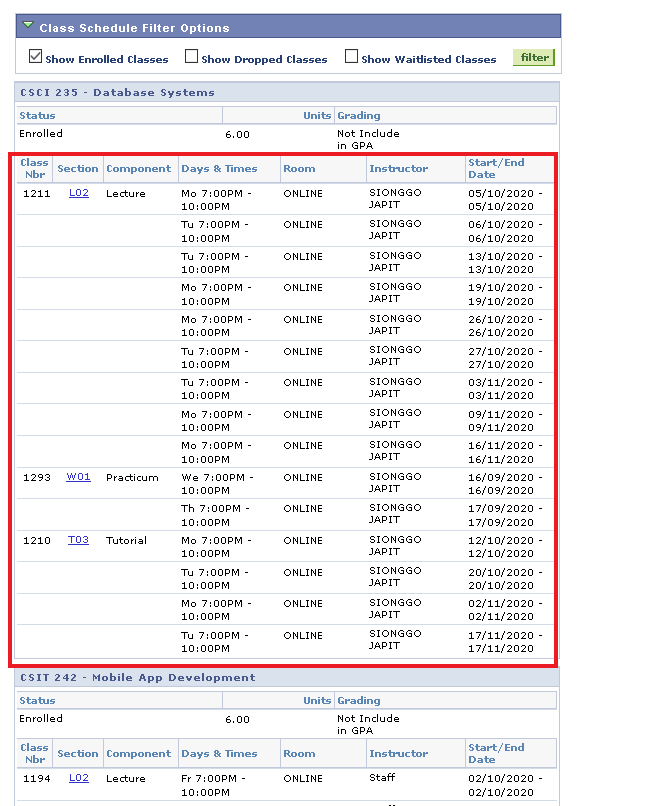

# Guide to export calendar

## Guide to export calendar

### Step 1:

Login to simconnect

### Step 2:

Go to My Apps > Self Service > Enrollment > My Timetable (List View: Class)

### Step 3:

Choose your term

### Step 4:

Copy Highlighted (Per Module) and paste into excel sheet




### Step 5:

Change **Class Nbr** Column into **Class** Column (Use data shown below) 


### Step 6:

fill up the blanks


### Step 7:

Save as input.csv and use python script. (Generates output.csv)
```
chmod +x SCtGC_convertor.py
python3 SCtGC_convertor.py
```

### Step 8:

Go to Google Calendar > Top Right Corner > Press the Gear > Settings


Go to Import & export


### Step 9:

Under Import > Select file from your computer > Select output.csv > Press Import
